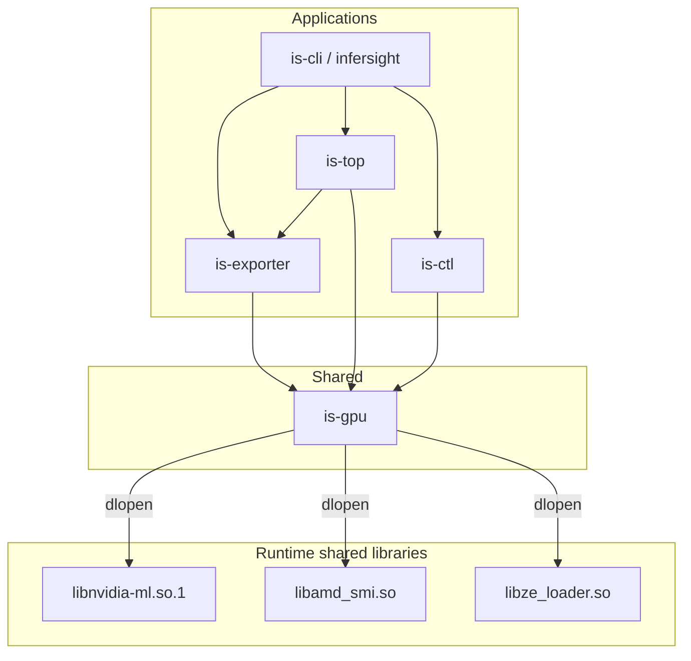

# Architecture

InferSight is a Cargo workspace centered on a single GPU abstraction crate that loads vendor libraries at runtime.

## High-level layout



## Why runtime loading?

- Compile and CI without CUDA / ROCm / oneAPI SDKs
- Ship one binary for CPU-only and multi-GPU machines
- Fail soft when a vendor `.so` or symbol is missing

`is-gpu` uses [`libloading`](https://docs.rs/libloading) to `dlopen` candidate sonames, resolves typed function pointers once into an `*Api` struct, and keeps the `Library` handle alive for the backend lifetime.

## `is-gpu`

```
crates/is-gpu/src/
  lib.rs
  device.rs          Vendor, GpuDevice
  metrics.rs         GpuBackend trait, DeviceMetrics
  process.rs         GpuProcessInfo
  loader.rs          GpuManager::discover()
  error.rs
  backend/           NvidiaBackend, AmdBackend, IntelBackend
  ffi/               dynlib + NVML / AMD SMI / Level Zero ABI
```

**Discovery:** try NVIDIA, AMD, and Intel independently. Successes stay active together.

**Public surface:**

- Metrics: `utilization`, memory, temperature, power, fan, clocks
- Identity: uuid, model, PCI bus id, serial
- Processes: NVML compute/graphics occupancy
- Control (NVIDIA/AMD): power limit, application clocks, perf level, reset

**Unsafe** stays in `ffi/`. Callers use owned Rust types only.

## Applications

| App | How it uses `is-gpu` |
|-----|----------------------|
| **is-exporter** | `collector::gpu::GpuCollector` → `GpuManager` → `GpuSnapshot` → Prometheus |
| **is-top** | Same collector via exporter lib; processes from `is-gpu` |
| **is-ctl** | `NvidiaBackend` / `AmdBackend` directly for list/info/set |
| **is-cli** | Thin subcommands over exporter / top / ctl |

## Vendor filter (exporter)

CLI flags `--nvidia`, `--amd`, `--intel`, `--all` map to `VendorFilter`. Discovery still probes all available libraries; collection only emits matching vendors.

## Adding a vendor

1. `ffi/<vendor>.rs` — ABI + `load()` + symbol table  
2. `backend/<vendor>.rs` — implement `GpuBackend` (+ control if needed)  
3. Register in `GpuManager::discover`  
4. Extend `Vendor` (`#[non_exhaustive]`)  

Public `GpuBackend` / `GpuManager` APIs stay stable.

## What was removed

Former crates **`is-nvidia`** (`nvml-wrapper`) and **`is-amd-ffi`** are gone. All telemetry and control go through **`is-gpu`** dlopen paths so the workspace has one GPU integration layer.
