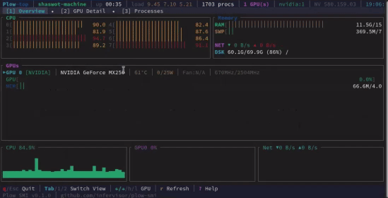

# Plow SMI

[](LICENSE)
[](https://www.rust-lang.org/)
[](https://nixos.org/)
[](https://infervisor.ai)

Production-grade GPU observability and control for heterogeneous compute — NVIDIA, AMD, and Intel — from one Rust workspace.

**No compile-time GPU SDKs.** Vendor libraries (`libnvidia-ml`, `libamd_smi`, `libze_loader`) are loaded at runtime with `dlopen`. One binary works on CPU-only hosts and enables GPUs automatically when drivers are present.



## Crates

| Crate | Role |
|-------|------|
| **plows-gpu** | Shared GPU layer: discover backends, metrics, processes, power/clock control |
| **plows-exporter** | Prometheus `/metrics` HTTP server |
| **plows-top** | Interactive TUI (htop for GPUs) |
| **plows-ctl** | List / info / set power & clocks |
| **plows-cli** | Unified `plow-smi` binary (`export`, `top`, `ctl`) |

See [ARCHITECTURE.md](ARCHITECTURE.md) for the design.

## Quick start

```bash
git clone https://github.com/infervisor/plow-smi.git
cd plow-smi
cargo build --release
```

```bash
# Prometheus exporter
./target/release/plows-exporter --all
# → http://0.0.0.0:9835/metrics

# Terminal monitor
./target/release/plows-top

# Control
./target/release/plows-ctl nvidia list
./target/release/plows-ctl amd list

# Unified CLI
./target/release/plow-smi export --all
./target/release/plow-smi top
./target/release/plow-smi ctl nvidia-list
```

Dev:

```bash
cargo run -p plows-gpu --example discover
cargo run -p plows-exporter -- --nvidia --system
cargo test -p plows-gpu
```

Or via [Nix](https://nixos.org/) flakes — every binary builds and runs individually:

```bash
nix build                # unified plow-smi CLI (default package)
nix build .#plows-exporter
nix build .#all          # every binary in one derivation
nix run .#plows-top
nix flake check          # build + test every package
```

A NixOS module for running the exporter as a systemd service is available at
`nixosModules.default` (`services.plow-smi-exporter`).

## Requirements

| Need | At build | At runtime |
|------|----------|------------|
| CUDA / ROCm / oneAPI SDKs | **Not required** | Not required |
| NVIDIA driver + `libnvidia-ml.so.1` | — | Optional (auto) |
| AMD ROCm + `libamd_smi.so` | — | Optional (auto) |
| Intel Level Zero + `libze_loader.so` | — | Optional (auto) |

Missing vendors are logged and skipped — never crash the process.

## Features

- Multi-vendor metrics (util, memory, temp, power, clocks, fan)
- Runtime backend discovery (multiple vendors active at once)
- Prometheus metrics with per-device labels
- TUI with GPU + system + process view
- Power limits / clocks / perf levels (NVIDIA + AMD; needs privileges)
- Structured logging via `tracing`

## Contributing

See [CONTRIBUTING.md](CONTRIBUTING.md). Please follow the
[Code of Conduct](CODE_OF_CONDUCT.md).

## Security

Report vulnerabilities privately — see [SECURITY.md](SECURITY.md).

## License

Copyright 2025 Shaswot Paudel.

Licensed under the [Apache License, Version 2.0](LICENSE).

## Code of Conduct

This project follows the [Contributor Covenant](CODE_OF_CONDUCT.md).
Report unacceptable behavior to **shaswot@infervisor.ai**.
