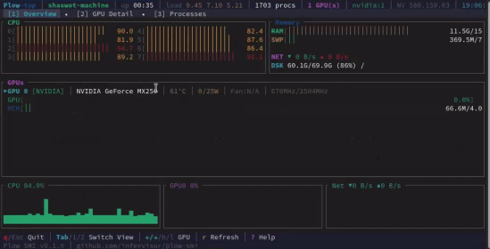

# Plow SMI

[](LICENSE)
[](https://www.rust-lang.org/)
[](https://nixos.org/)
[](https://infervisor.ai)

Production-grade GPU observability and control for heterogeneous compute — NVIDIA, AMD, Intel, and Apple Silicon — from one Rust workspace.

**No compile-time GPU SDKs.** Vendor libraries (`libnvidia-ml`, `libamd_smi`, `libze_loader`) are loaded at runtime with `dlopen`. One binary works on CPU-only hosts and enables GPUs automatically when drivers are present.



## Crates

| Crate | Role |
|-------|------|
| **plows-gpu** | Shared GPU layer: discover backends, metrics, processes, power/clock control |
| **plows-exporter** | Prometheus `/metrics` HTTP server |
| **plows-top** | Interactive TUI (htop for GPUs) |
| **plows-ctl** | List / info / set power & clocks |
| **plows-cli** | Unified `plow-smi` binary (`export`, `top`, `ctl`) |

See [ARCHITECTURE.md](ARCHITECTURE.md) for the design.

## Quick start

```bash
git clone https://github.com/infervisor/plow-smi.git
cd plow-smi
cargo build --release
```

```bash
# Prometheus exporter
./target/release/plows-exporter --all
# → http://0.0.0.0:9835/metrics

# Terminal monitor
./target/release/plows-top

# Control
./target/release/plows-ctl nvidia list
./target/release/plows-ctl amd list

# Unified CLI
./target/release/plow-smi export --all
./target/release/plow-smi top
./target/release/plow-smi ctl nvidia-list
```

Dev:

```bash
cargo run -p plows-gpu --example discover
cargo run -p plows-exporter -- --nvidia --system
cargo test -p plows-gpu
```

Or via [Nix](https://nixos.org/) flakes — every binary builds and runs individually:

```bash
nix build                # unified plow-smi CLI (default package)
nix build .#plows-exporter
nix build .#all          # every binary in one derivation
nix run .#plows-top
nix flake check          # build + test every package
```

A NixOS module for running the exporter as a systemd service is available at
`nixosModules.default` (`services.plow-smi-exporter`).

## Binary releases

[GitHub Releases](https://github.com/infervisor/plow-smi/releases) provide archives
for Linux and macOS, each on **x86_64** and **aarch64 (ARM64)**. Every archive
contains all four CLI binaries. Linux AMD, NVIDIA and Intel support share the
same build; no vendor SDK or GPU is needed to build it. macOS ARM64 additionally
supports Apple Silicon; macOS x86_64 provides system monitoring, not Apple GPU
telemetry. GPU support still depends on drivers being available for your platform.

```bash
# Download the archive for your platform and SHA256SUMS from the same release.
sha256sum --ignore-missing --check SHA256SUMS  # macOS: shasum -a 256 -c SHA256SUMS
tar -xzf plow-smi-0.1.0-x86_64-linux.tar.gz
./plow-smi-0.1.0-x86_64-linux/bin/plow-smi --help
```

**Keep the extracted directory together.** Add its `bin` directory to `PATH`, or
symlink an entry point into `/usr/local/bin`; do not copy Linux launchers alone.
No Nix installation is required to run the releases.

Rust dependencies are statically linked. Linux retains dynamic glibc because a
fully static musl executable cannot `dlopen` GPU drivers. The archive bundles a
matching loader and its runtime dependencies under `lib/`, with small `/bin/sh`
launchers in `bin/`. This avoids requiring the host's glibc version or Nix store.
Vendor libraries are **not bundled**: install NVIDIA NVML, AMD SMI/ROCm, or Intel
Level Zero on the host. Standard distribution, NixOS driver and ROCm library
directories are searched; use `LD_LIBRARY_PATH` for custom installations.
Vendor libraries and their dependencies must match the host architecture and
remain compatible with the bundled glibc. Linux kernel compatibility follows
the glibc baseline pinned in `flake.lock`; real GPU hardware is not exercised by CI.

macOS binaries link only Apple system libraries/frameworks and are ad-hoc signed
(not notarized). They require no bundled third-party dylibs; OS compatibility
follows the SDK/deployment target of the pinned Nix toolchain. Apple private
telemetry APIs retain the compatibility caveats documented below.

### Building and publishing

```bash
nix build .#release       # result/*.tar.gz and per-archive SHA-256 checksums
```

`.github/workflows/release.yml` builds and tests all four native platforms on
pull requests, pushes to `main`/`master`, and manual runs. Linux archives are also
tested in Ubuntu, Debian and Alpine containers without `/nix/store`, including
mock NVIDIA/AMD driver loading. Archives use normalized timestamps and ownership.
Linux runtime source archives include glibc/GCC source, patches, licenses and
the pinned Nix and application build recipes; these are distributed beside the
binary archives. Runtime license texts are also included in the Linux binaries'
archive. Release tooling unit tests run both in Actions and `nix flake check`.

To publish, set `[workspace.package].version` in `Cargo.toml`, refresh
`Cargo.lock` with Cargo, commit, then push a matching tag (e.g. `v0.1.0`). Tag
and workspace version must match. Only after every platform passes does the
workflow publish archives and `SHA256SUMS` to GitHub Releases. Tags containing
a prerelease suffix are published as prereleases. The workflow uses only
`GITHUB_TOKEN`; repository Actions must be allowed to create releases. It does
not overwrite an existing release.

## Requirements

### Apple Silicon

Native ARM64 macOS support provides CPU/GPU activity, clocks, power, temperatures,
unified memory, and Neural Engine power without sudo. Unsupported ANE utilization
and clocks remain absent; shared RAM is not reported as dedicated VRAM.

```bash
plow-smi top
plow-smi ctl apple-info --format json
plow-smi export --apple --system --bind 127.0.0.1
```

Apple control is read-only. Hardware validated on M4 Pro / macOS 26.5.1;
other M-series Macs are intended but unverified. Apple private APIs may change.
See [DESIGN_APPLE_SILICON.md](DESIGN_APPLE_SILICON.md) for compatibility and
direct Rust library integration details.

| Need | At build | At runtime |
|------|----------|------------|
| CUDA / ROCm / oneAPI SDKs | **Not required** | Not required |
| NVIDIA driver + `libnvidia-ml.so.1` | — | Optional (auto) |
| AMD ROCm + `libamd_smi.so` | — | Optional (auto) |
| Intel Level Zero + `libze_loader.so` | — | Optional (auto) |

Missing vendors are logged and skipped — never crash the process.

## Features

- Multi-vendor metrics (util, memory, temp, power, clocks, fan)
- Runtime backend discovery (multiple vendors active at once)
- Prometheus metrics with per-device labels
- TUI with GPU + system + process view
- Power limits / clocks / perf levels (NVIDIA + AMD; needs privileges)
- Structured logging via `tracing`

## Contributing

See [CONTRIBUTING.md](CONTRIBUTING.md). Please follow the
[Code of Conduct](CODE_OF_CONDUCT.md).

## Security

Report vulnerabilities privately — see [SECURITY.md](SECURITY.md).

## License

Copyright 2025 Shaswot Paudel.

Licensed under the [Apache License, Version 2.0](LICENSE).

## Code of Conduct

This project follows the [Contributor Covenant](CODE_OF_CONDUCT.md).
Report unacceptable behavior to **shaswot@infervisor.ai**.
